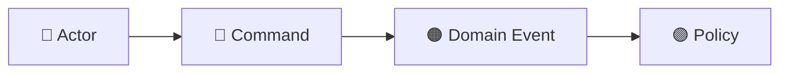
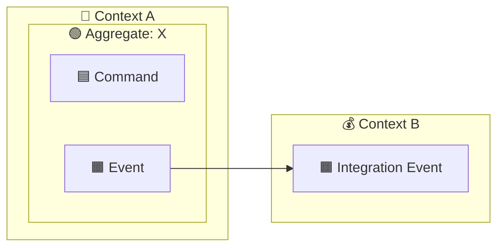
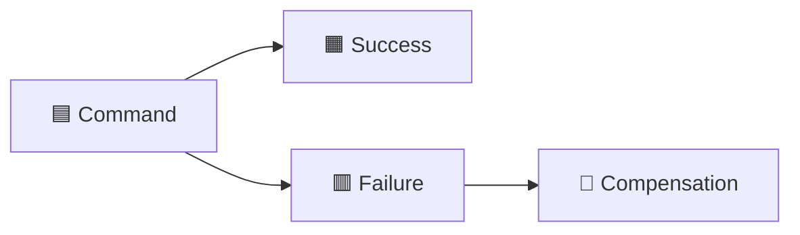
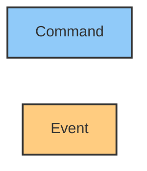

# Event Storming Skill

Helps facilitate, document, and represent Event Storming sessions in text, Mermaid diagrams,
and DDD structures. Applies both to modeling from scratch and to converting existing business
descriptions into structured artifacts.

---

## 1. Understand the Scope

Before modeling, gather:

- **Process/domain** to be mapped (e.g., student enrollment, license management, e-commerce).
- **Desired level**:
  - **Big Picture** — broad view, high-level business flow.
  - **Process Modeling** — detailed view of a specific flow.
  - **Software Design** — focus on aggregates, commands, and code.
- **Expected output format**: structured text, Mermaid diagram, summary table, or all three.

If this information is not available, ask before proceeding.

---

## 2. Visual Convention

Always use this emoji/color convention in both text and diagrams:

| Element                | Emoji | Description                                                   |
| ---------------------- | ----- | ------------------------------------------------------------- |
| Domain Event           | 🟧    | Fact that occurred in the past (e.g., "License was assigned") |
| Command                | 🟦    | Intent to perform an action (e.g., "AssignLicense")           |
| Policy / Trigger       | 🟨    | Automatic rule or job (e.g., "daily cron job")                |
| Result / Read Model    | 🟩    | Observable system effect (e.g., dashboard updated)            |
| Compensation / Failure | 🟥    | Rollback, error, or SAGA compensation                         |
| Actor                  | 👤    | Person or role that issues the command                        |
| External System        | 🌐    | Integrations (Moodle, HubSpot, Payment Gateway)               |
| Aggregate              | 🟢    | Consistency root entity (subgraph in Mermaid)                 |

---

## 3. Flow Structure

For each identified flow, document:

```text
## [Flow Name]

**Actor:** [who initiates] · **Trigger:** [what] · **Correlation:** [if applicable]

[diagram or structured text here]

**Post-condition (success):**
- [list of observable effects]
```

---

## 4. Modeling Rules

### Domain Events

- Always in the **past tense** (e.g., "Enrollment was completed", `LicenseAssigned`).
- Represent **immutable** and **observable** facts.
- An event may trigger policies or other commands.

### Commands

- In the **infinitive** or nominal form (e.g., "Request Enrollment", `AssignLicenses`).
- Always associated with an **actor** or **policy**.
- May fail — always model both the happy path and compensation path.

### Policies

- Conditional statements: "When [event] → execute [command]".
- Can be triggered by cron jobs (🟨), webhooks, or business rules.

### Aggregates

- Group commands and events that share consistency boundaries.
- In Mermaid, use `subgraph`.

### Bounded Contexts

- Separate by language and business rules.
- Map dependencies between contexts using integration events.

### Compensations (SAGA)

- Always document when an operation involves external integrations.
- List which steps can be reverted and how.

---

## 5. Output Format: Structured Text

Use this pattern for detailed flows (Software Design):

```text
🟦 CommandName(parameters)
   │
   ├─ Validations:
   │   • rule 1
   │   • rule 2
   │
   ├─ DB: database operations
   │
   ├─ Integration ACL:
   │   1. externalSystem.operation()
   │
   ├─ DB COMMIT
   │
   ├─ 🟧 Event: EventName
   ├─ Audit: record action
   ├─ Notification: send email/notification
   ├─ 🟩 Read model: observable effect
   │
   └─ HTTP [status code] → response to frontend

🟥 Failure:
   ├─ ROLLBACK
   ├─ Compensation: [what to revert]
   ├─ 🟧 Event: FailureEventName
   └─ HTTP [status code] → error message
```

---

## 6. Output Format: Mermaid Diagram

### Basic Flow



### With Aggregates and Bounded Contexts



### With Compensation



### Applying Colors



---

## 7. Summary Table

Always generate a table at the end of the mapping:

| Command       | Emitted Events     | Affected Read Models |
| ------------- | ------------------ | -------------------- |
| `CommandName` | `Event1`, `Event2` | dashboard, audit log |

---

## 8. Hotspots

Explicitly mark points of attention:

```text
⚠️ Hotspot: [description of the uncertainty, conflict, or undefined rule]
```

---

## 9. Recommended Workflow

1. Gather the process description (free text, requirements, user stories).
2. Identify domain events (past-tense nouns or statements).
3. Identify commands (what caused each event).
4. Identify actors and external systems.
5. Identify policies and automatic triggers.
6. Group into aggregates.
7. Separate into bounded contexts.
8. Map compensations/failures.
9. Generate structured text + Mermaid diagram + summary table.
10. Mark hotspots.

---

## 10. Additional References

- For detailed examples of real-world flows (license assignment, bulk import, contract expiration, MFA), see: `references/real-world-examples.md`
- For a complete mapping of elements and advanced Mermaid styles, see: `references/mermaid-guide.md`
