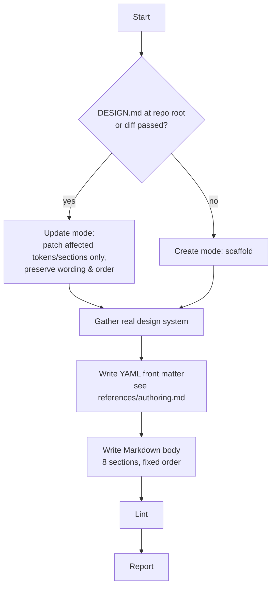

# generate-design-md

Produce a `DESIGN.md` per the Google Labs spec: YAML front matter of design
tokens + Markdown body of rationale. One file, repo root, version controlled
next to code.

## Flow



## 1. Gather the real design system

Document what the code does, not an ideal. Sources, priority order:

| #   | Source                                                                                      |
| --- | ------------------------------------------------------------------------------------------- |
| 1   | `tailwind.config.*` / `theme` extend (colors, fontFamily, spacing, borderRadius, boxShadow) |
| 2   | CSS custom properties (`:root { --color-*, --space-* }`), `@theme` blocks                   |
| 3   | Design-token files (`tokens.json`, DTCG, Style Dictionary)                                  |
| 4   | SCSS/Less vars, styled-components / vanilla-extract themes                                  |
| 5   | Component files — recurring className patterns, variant props                               |
| 6   | Figma export / screenshots the user supplies                                                |

Use `grep` / `rag-rat` for targeted extraction — don't read whole files when a
pattern search finds the tokens.

## 2. Write front matter + body

Full template, front-matter rules, and the section table are in
**`references/authoring.md`**. Complete worked example in
**`references/example-DESIGN.md`**. Format spec + all 11 lint rules in
**`references/spec.md`**.

## 3. Lint

```bash
npx @google/design.md lint DESIGN.md
```

Fix `broken-ref` errors (exit 1). Resolve warnings or justify. In update mode,
`npx @google/design.md diff old new` to confirm no regressions.

## 4. Report

Mode used · token counts (colors / typography / spacing / components) ·
sections written vs omitted · lint result.
