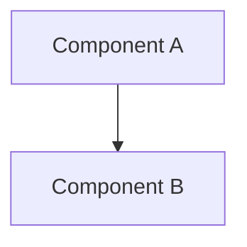

# <Project Name>

<!-- One sentence: what is this system, what problem does it solve, and for whom? -->

## Overview

<!-- 3–5 sentences. Describe the system's purpose, its primary users, and its value.
     Avoid mentioning internal technologies or code structure. -->

## High-Level Architecture

<!-- 2–3 sentences describing the architectural style (e.g., modular monolith, CLI tool,
     event-driven service). Follow with a Mermaid diagram showing top-level components. -->

## Modules

<!-- Table of every top-level module. Link each name to its docs/modules/<module>.md file.
     One-sentence purpose per module — no implementation details. -->

| Module                          | Location  | Purpose                       |
| ------------------------------- | --------- | ----------------------------- |
| [<module>](modules/<module>.md) | `<path/>` | <!-- one-sentence purpose --> |

## Quick Start

<!-- Minimum commands to get the system running locally. 3–5 steps max.
     Link to [setup.md](setup.md) for the complete guide. -->

## Documentation Index

<!-- Links to every document under docs/. Always keep this list up to date. -->

- [Architecture](architecture.md)
- [Setup](setup.md)
- [Usage](usage.md)
- [Contribution](contribution.md)

## Architectural Decisions

<!-- Optional. Include only if docs/adr/ exists. List decisions with links. -->

## Technologies

<!-- Optional. Include only if docs/techs/ exists. List technologies with links. -->

## FAQ / Common Issues

<!-- Optional. Include only if docs/faq.md exists. Link to it here. -->
