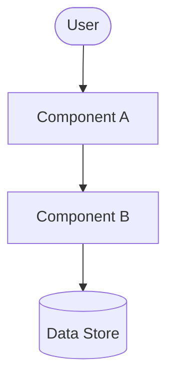

# Architecture

> **Audience:** Developers, architects, tech leads

## Objectives and Context

<!-- What is the system trying to achieve architecturally?
     What constraints or requirements shaped the design?
     2–4 sentences — no source code references. -->

## System Overview

<!-- A Mermaid diagram showing all top-level components and how they connect.
     Use C4 Context or Component level. Every major module must appear.
     DO NOT describe internal classes or function calls here. -->



## Main Components

<!-- One row per major component. Describe its RESPONSIBILITY — not how it
     is implemented internally. Link to the relevant module doc. -->

| Component | Responsibility        | Module Doc                  |
| --------- | --------------------- | --------------------------- |
| `<name>`  | <!-- what it does --> | [link](modules/<module>.md) |

## Data Flow

<!-- Describe how data moves through the system for the primary use case.
     Use a Mermaid sequence or flowchart diagram.
     Focus on WHAT flows and between WHICH components — not how it is processed internally. -->

```mermaid
sequenceDiagram
    Actor->>ComponentA: action
    ComponentA->>ComponentB: request
    ComponentB-->>ComponentA: response
```

## Patterns and Principles

<!-- What architectural patterns are applied? (e.g., layered, event-driven, hexagonal)
     Why were they chosen? What trade-offs do they introduce?
     3–6 bullet points — no code examples. -->

## Important Decisions

<!-- Key decisions that shaped the architecture. For each, state the decision and
     link to the relevant ADR in docs/adr/ where available. -->

## External Integrations

<!-- What external systems, APIs, or services does this system integrate with?
     Describe each at boundary level — not the internal adapter code. -->

| Integration | Direction | Purpose |
| ----------- | --------- | ------- |

## Security and Scalability Considerations

<!-- High-level security model (auth, trust boundaries) and scalability approach.
     What are the known limits? What must be considered before extending the system?
     Do NOT reference internal security libraries or implementation details. -->
