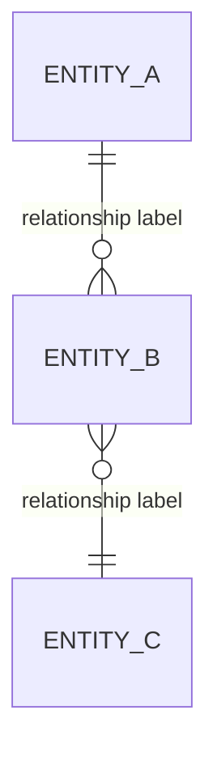
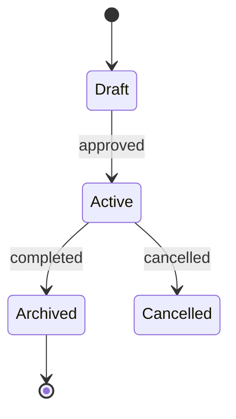

# Data Models

> **Audience:** Developers, data analysts, integrators

## Overview

<!-- What real-world domain does the data model represent?
     What are the core entities and why do they exist in this system?
     2–4 sentences at domain level — no schema definitions, ORM code, or table names. -->

## Entity Map

<!-- High-level ERD showing entities and their relationships.
     Use domain-level entity names — not database table names or class names.
     Show cardinality and relationship labels only; omit attributes here. -->

## Entities

<!-- One subsection per entity. For each entity describe:
     1. What real-world concept it represents (1–2 sentences).
     2. Its KEY attributes: name + business meaning (not data type or constraint).
     3. Its relationships to other entities (reference entity names, not foreign keys).
     4. Which module or service is responsible for managing it.

     ⚠️ Do NOT include: SQL DDL, ORM annotations, validation rules, or serializer code.
        The agent reads the actual source files for those details. -->

### <Entity Name>

<!-- What real-world concept does this entity represent? -->

**Key attributes:**

| Attribute | Business Meaning                          |
| --------- | ----------------------------------------- |
| `<name>`  | <!-- what it represents in the domain --> |

**Relationships:**

<!-- Link to related entity sections within this file. -->

**Owning module:** [<module>](modules/<module>.md)

---

### <Entity Name 2>

<!-- Repeat the pattern above for every entity. -->

## Lifecycle and State Transitions

<!-- Optional — include only for entities with non-trivial lifecycles (e.g., Order, Job, Request).
     Show the state machine as a Mermaid stateDiagram.
     Name states in business terms, not technical status codes. -->

## Data Ownership

<!-- Which module or service is the authoritative writer for each entity?
     This defines trust boundaries and prevents split-brain writes. -->

| Entity     | Owning Module                   | Read Access                            |
| ---------- | ------------------------------- | -------------------------------------- |
| `<Entity>` | [<module>](modules/<module>.md) | <!-- any module / specific modules --> |
