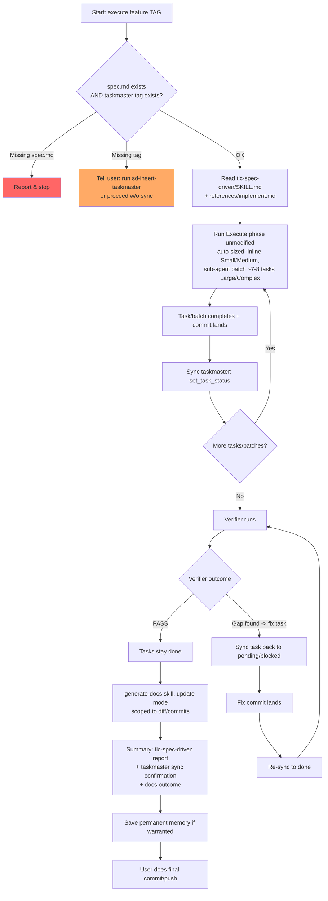

# Execution Flow Diagram

```mermaid
flowchart TD
    A[Start: execute feature TAG] --> B{spec.md exists<br/>AND taskmaster tag exists?}
    B -->|Missing spec.md| Z1[Report & stop]
    B -->|Missing tag| Z2[Tell user: run sd-insert-taskmaster<br/>or proceed w/o sync]
    B -->|OK| C[Read tlc-spec-driven/SKILL.md<br/>+ references/implement.md]
    C --> D[Run Execute phase unmodified<br/>auto-sized: inline Small/Medium,<br/>sub-agent batch ~7-8 tasks Large/Complex]
    D --> E[Task/batch completes + commit lands]
    E --> F[Sync taskmaster: set_task_status]
    F --> G{More tasks/batches?}
    G -->|Yes| D
    G -->|No| H[Verifier runs]
    H --> I{Verifier outcome}
    I -->|PASS| J[Tasks stay done]
    I -->|Gap found -> fix task| K[Sync task back to pending/blocked]
    K --> L[Fix commit lands]
    L --> M[Re-sync to done]
    M --> H
    J --> N[generate-docs skill, update mode<br/>scoped to diff/commits]
    N --> O[Summary: tlc-spec-driven report<br/>+ taskmaster sync confirmation<br/>+ docs outcome]
    O --> P[Save permanent memory if warranted]
    P --> Q[User does final commit/push]

    style Z1 fill:#f66
    style Z2 fill:#fa6
```

Taskmaster mirrors progress; tlc-spec-driven's own auto-sizing/batching/Verifier drive execution.
