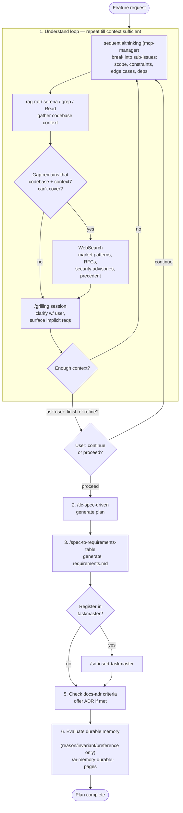

# sd-planning — Flow Diagram

```mermaid
flowchart TD
    Start([Feature request]) --> Loop

    subgraph Loop["1. Understand loop — repeat till context sufficient"]
        direction TB
        A1["sequentialthinking (mcp-manager)
        break into sub-issues:
        scope, constraints, edge cases, deps"] --> A2
        A2["rag-rat / serena / grep / Read
        gather codebase context"] --> A3{"Gap remains that
        codebase + context7
        can't cover?"}
        A3 -- yes --> A2b["WebSearch
        market patterns, RFCs,
        security advisories, precedent"]
        A3 -- no --> A4
        A2b --> A4
        A4["/grilling session
        clarify w/ user,
        surface implicit reqs"] --> A5{"Enough context?"}
        A5 -- no --> A1
    end

    A5 -- ask user: finish or refine? --> Decide{"User: continue
    or proceed?"}
    Decide -- continue --> A1
    Decide -- proceed --> B["2. /tlc-spec-driven
    generate plan"]
    B --> C["3. /spec-to-requirements-table
    generate requirements.md"]
    C --> D{"Register in
    taskmaster?"}
    D -- yes --> E["/sd-insert-taskmaster"]
    D -- no --> F
    E --> F["5. Check docs-adr criteria
    offer ADR if met"]
    F --> G["6. Evaluate durable memory
    (reason/invariant/preference only)
    /ai-memory-durable-pages"]
    G --> End([Plan complete])
```

Track via `TaskCreate`/`TaskUpdate`/`TaskGet`/`TaskList` through all steps — status updates keep user informed.
