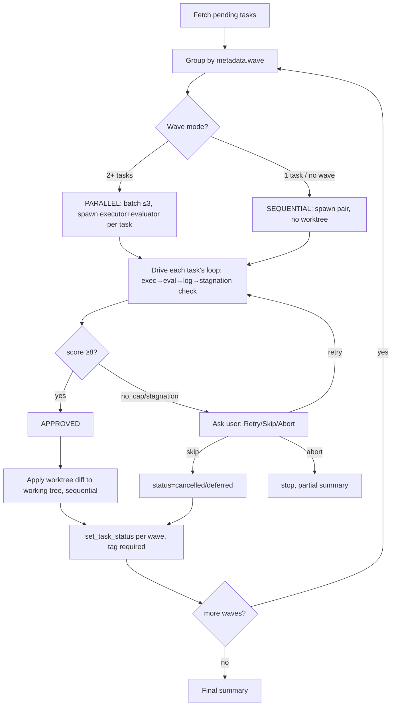

# Main-Agent-as-Orchestrator Model

Main agent is both orchestrator AND adversarial-loop driver — no `Skill(adversarial-dev)` call per task. It applies `adversarial-dev`'s Step 0-4 loop mechanics inline via direct `Agent`/`SendMessage` calls.

## Per-task context package (built before dispatch)

| Field                | Source                                                                  |
| -------------------- | ----------------------------------------------------------------------- |
| Task object          | taskmaster (id, title, description, deps, verification criteria)        |
| Spec/design excerpt  | scoped to the task, not full files                                      |
| File references      | absolute paths to spec.md/design.md/metadata.json                       |
| Scoped test/lint cmd | narrower than module-wide `testCommands`, derived from task's own files |
| Expected file paths  | from spec/design if named                                               |
| No-commit directive  | executor never commits — overrides tlc-spec-driven default              |

## Executor model selection (Step 4a.5)

| Complexity                                | Model                                                                |
| ----------------------------------------- | -------------------------------------------------------------------- |
| trivial (single small edit, no ambiguity) | haiku                                                                |
| medium/hard/unclear                       | sonnet (default when in doubt — wrong haiku pick costs a full retry) |

Evaluator always uses default model, never the executor's override.

## Notes

- PARALLEL batches capped at 3 concurrent tasks; each parallel task's executor runs in an isolated git worktree.
- Diffs of APPROVED tasks are applied (`git apply`, staged/unstaged, never committed) sequentially at end of wave/batch; conflicts → `resolve-merge-conflicts` skill.
- `set_task_status` requires `tag` param — without it, call succeeds but changes nothing.
- Status update happens per-wave, not batched to the end.
