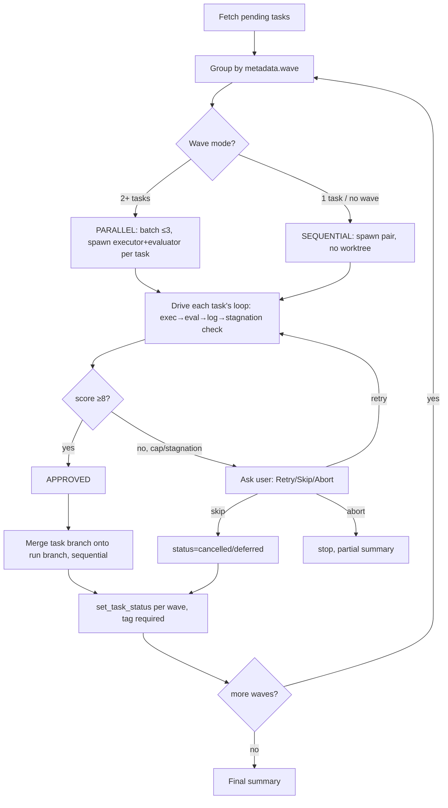

# Main-Agent-as-Orchestrator Model

Main agent is both orchestrator AND adversarial-loop driver — reads `tlc-spec-driven/SKILL.md` and `adversarial-dev/SKILL.md` once each, orchestrator-side, before dispatch; no `Skill` call per task for either. It applies `adversarial-dev`'s Step 0-4 loop mechanics inline via direct `Agent`/`SendMessage` calls.

```mermaid
flowchart TD
    A[Fetch pending tasks] --> B[Group by metadata.wave]
    B --> C{Wave mode?}
    C -->|2+ tasks| D[PARALLEL: batch ≤3, spawn executor+evaluator per task]
    C -->|1 task / no wave| E[SEQUENTIAL: spawn pair, no worktree]
    D --> F[Drive each task's loop: exec→eval→log→stagnation check]
    E --> F
    F --> G{score ≥8?}
    G -->|yes| H[APPROVED]
    G -->|no, cap/stagnation| I[Ask user: Retry/Skip/Abort]
    H --> J[Merge task branch onto run branch, sequential]
    I -->|retry| F
    I -->|skip| K[status=cancelled/deferred]
    I -->|abort| L[stop, partial summary]
    J --> M[set_task_status per wave, tag required]
    K --> M
    M --> N{more waves?}
    N -->|yes| B
    N -->|no| O[Final summary]
```

## Per-task context-map (built before dispatch)

| Field                | Source                                                                                               |
| -------------------- | ---------------------------------------------------------------------------------------------------- |
| Task object          | this task's section of `tasks.md` + taskmaster (id, title, description, deps, verification criteria) |
| Spec/design excerpt  | scoped to the task, not full files                                                                   |
| Source file excerpts | relevant snippets of files the task will touch, located via grep/glob — not full file contents       |
| Scoped test/lint cmd | narrower than module-wide `testCommands`, derived from task's own files                              |
| Expected file paths  | from spec/design if named                                                                            |

Executor commits freely inside its own worktree (never full spec files, never a `Skill(tlc-spec-driven)` call) — commits stay isolated until merged in 4c.

## Executor model selection (Step 4a.5)

| Complexity                                | Model                                                                |
| ----------------------------------------- | -------------------------------------------------------------------- |
| trivial (single small edit, no ambiguity) | haiku                                                                |
| medium/hard/unclear                       | sonnet (default when in doubt — wrong haiku pick costs a full retry) |

Evaluator always uses default model, never the executor's override.

## Notes

- PARALLEL batches capped at 3 concurrent tasks; each parallel task's executor runs in an isolated git worktree.
- APPROVED task branches are merged (`git merge --no-ff`) onto the run branch sequentially at end of wave/batch; conflicts → `resolve-merge-conflicts` skill.
- `set_task_status` requires `tag` param — without it, call succeeds but changes nothing.
- Status update happens per-wave, not batched to the end.
