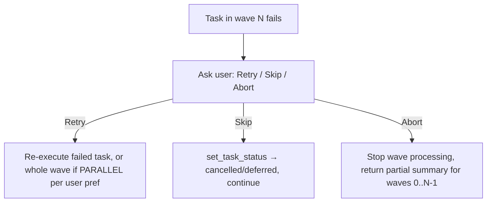

# Orchestrator Model

Main agent is the orchestrator. It never delegates coordination to another skill — it spawns subagents directly via the Agent tool, and directly waits on/aggregates their results.

## Wave dispatch

| Wave mode  | Trigger                                | Dispatch                                                                        |
| ---------- | --------------------------------------- | -------------------------------------------------------------------------------|
| PARALLEL   | 2+ independent tasks in wave           | One Agent call per task, all in one message block → true concurrency            |
| SEQUENTIAL | 1 task, or tasks with no wave metadata | No subagent — main agent executes task directly inline (tlc-spec-driven logic) |

Wave N+1 does not start until every wave-N task (subagent or inline) has finished.

When ALL tasks across the whole run are sequential (no wave has 2+ tasks), skip subagent delegation entirely — main agent executes every task inline, one after another.

## Failure handling (Step 4b)



## Status sync (Step 5)

```
mcp__mcp-manager__call_tool({
  "server": "taskmaster-ai",
  "tool_name": "set_task_status",
  "arguments": {
    "projectRoot": "{PROJECT_ROOT}",
    "id": "{TASK_ID}",
    "status": "{done|deferred|cancelled}",
    "tag": "{TAG}"
  }
})
```

`tag` is required — without it the call reports success but makes no actual change.

| Outcome               | status value              |
| --------------------- | ------------------------- |
| Task succeeded        | `done`                    |
| Skipped (user choice) | `cancelled` or `deferred` |
| Failed, not retried   | `blocked` or `deferred`   |

Update after each wave completes — do not wait until all waves finish.
