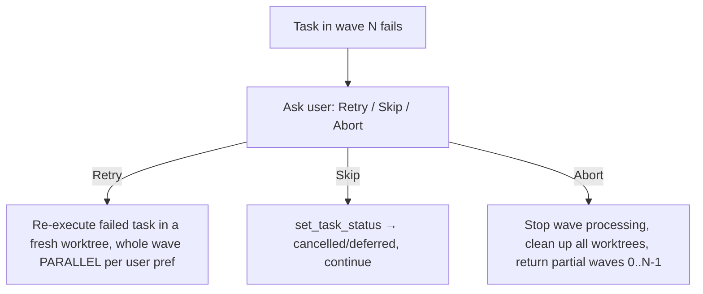
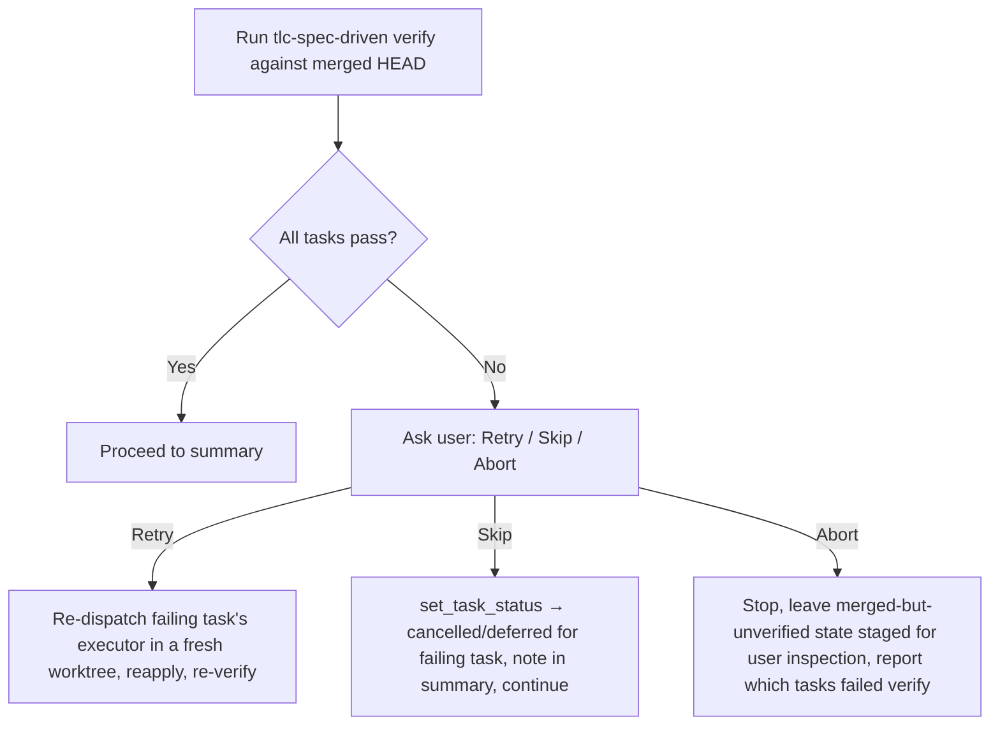

# Orchestrator Model

Main agent is the orchestrator. It never delegates coordination to another skill — spawns executors directly via the Agent tool, each in its own isolated worktree, and directly waits on/aggregates results.

## Run branch setup

- `git status --porcelain` — dirty tree → abort before touching anything.
- Record original HEAD (branch name), `git switch -c <head-branch>-{TAG}` from it — checked out.
- Every task executor branches its own worktree off this run branch, never off the user's original branch directly.

## Wave dispatch

| Wave mode  | Trigger                              | Dispatch                                                                                                                                                              |
| ---------- | ------------------------------------ | --------------------------------------------------------------------------------------------------------------------------------------------------------------------- |
| PARALLEL   | 2+ independent tasks in wave         | Batch ≤3 tasks concurrently — one Agent call per task, each in its own worktree off the run branch, all in one message block per batch → true concurrency capped at 3 |
| SEQUENTIAL | 1 task, or task has no wave metadata | Still one Agent call, own worktree — no inline execution by the main agent                                                                                            |

Wave with more than 3 tasks splits into sequential batches of ≤3 (e.g. 7 tasks → batches of 3, 3, 1). Wait for the whole batch before the next batch; wait for the whole wave before starting wave N+1.

If the whole run has no wave metadata (all tasks wave 0 / sequential), every task still gets its own worktree executor — one at a time, never batched.

## Per-task executor lifecycle

1. `git worktree add <path> -b <task-branch> <run-branch>`
2. Dispatch executor Agent into that worktree (see `agent-prompts.md`)
3. Executor implements task, produces a diff (does not merge/push itself)
4. On approval, orchestrator applies the diff onto the run branch: `git apply <diff>` in task order — conflicts go to `resolve-merge-conflicts` skill
5. Clean up: `git worktree remove <path>` + `git branch -D <task-branch>` — always, win or lose. Never `rm -rf` a worktree directly.

## Failure handling (Step 5b)


```mermaid
flowchart TD
    F[Task in wave N fails] --> Ask[Ask user: Retry / Skip / Abort]
    Ask -->|Retry| R[Re-execute failed task in a fresh worktree, whole wave PARALLEL per user pref]
    Ask -->|Skip| S["set_task_status → cancelled/deferred, continue"]
    Ask -->|Abort| A[Stop wave processing, clean up all worktrees, return partial waves 0..N-1]
```

## Status sync (Step 8)

```
mcp__mcp-manager__call_tool({
  "server": "taskmaster-ai",
  "tool_name": "set_task_status",
  "arguments": {
    "projectRoot": "{PROJECT_ROOT}",
    "id": "{TASK_ID}",
    "status": "{done|deferred|cancelled}",
    "tag": "{TAG}"
  }
})
```

`tag` required — without it the call reports success but makes no actual change.

| Outcome  | Status set  |
| -------- | ----------- |
| Complete | `done`      |
| Skipped  | `cancelled` |
| Deferred | `deferred`  |
| Blocked  | `blocked`   |

Update after each wave completes — do not wait until all waves finish.

## Merge back

Once all waves are done (or aborted with partial completion), merge the run branch into the original HEAD with `--no-ff`, leaving the result staged/uncommitted for user review. Do not commit or push — that decision belongs to the user.

## Post-merge verify gate (Step 9.5)

After merge, main agent inline-runs `tlc-spec-driven`'s verify phase against the merged result, checking each completed task's verification criteria from the spec. Main agent qualifies as verifier (author != verifier) since it did not implement any task itself — only executors did.


```mermaid
flowchart TD
    V[Run tlc-spec-driven verify against merged HEAD] --> P{All tasks pass?}
    P -->|Yes| Done[Proceed to summary]
    P -->|No| Ask[Ask user: Retry / Skip / Abort]
    Ask -->|Retry| RR[Re-dispatch failing task's executor in a fresh worktree, reapply, re-verify]
    Ask -->|Skip| SS["set_task_status → cancelled/deferred for failing task, note in summary, continue"]
    Ask -->|Abort| AA[Stop, leave merged-but-unverified state staged for user inspection, report which tasks failed verify]
```
