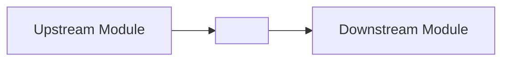

# `<module-name>` — Module Context

> **Audience:** Developers new to this module | **Source of truth:** [`docs/modules/<module-name>.md`](../../docs/modules/<module-name>.md)

---

## Purpose and Responsibilities

<!-- 2–4 sentences: what this module does and why it exists.
     Focus on the "what" and "why", not the "how". -->

## Role in the Architecture

<!-- Describe where this module sits in the overall system.
     Which layer does it belong to (infrastructure, domain, API, UI, …)?
     Add a minimal Mermaid diagram when helpful. -->

## Interactions with Other Modules

<!-- Table of direct dependencies and dependents. -->

| Direction   | Module     | Nature of Interaction                        |
| ----------- | ---------- | -------------------------------------------- |
| Depends on  | `<module>` | Brief description of what is consumed        |
| Depended by | `<module>` | Brief description of what is exposed/emitted |

## Key Concepts and Abstractions

<!-- List the 3–7 domain terms, patterns, or mental models a developer
     must understand before reading the code. Keep each entry to 1 sentence. -->

- **`<Term>`** — definition / role.

## Entry Points

<!-- Where should a new developer start reading?
     List the main file(s), class(es), or exported symbol(s). -->

- [`<file>`](relative-path) — reason to start here.

## Scope Boundaries (What This Module Is NOT)

<!-- Explicit constraints prevent misuse and repeated design debates. -->

- Does **not** handle `<responsibility>` — that belongs to `<other-module>`.

---

> _Generated by [generate-docs-init](../../skills/generate-docs-init/SKILL.md). Keep this file high-level; avoid implementation details._
